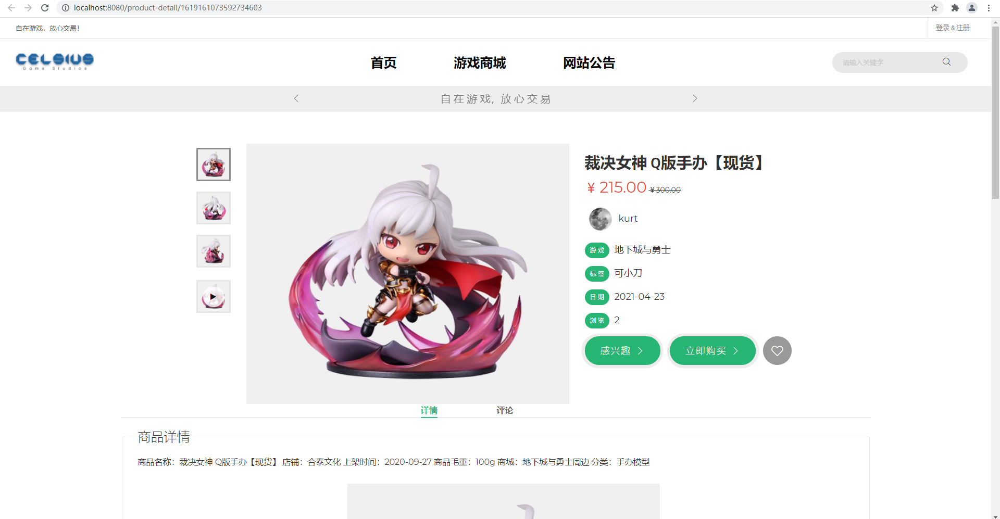
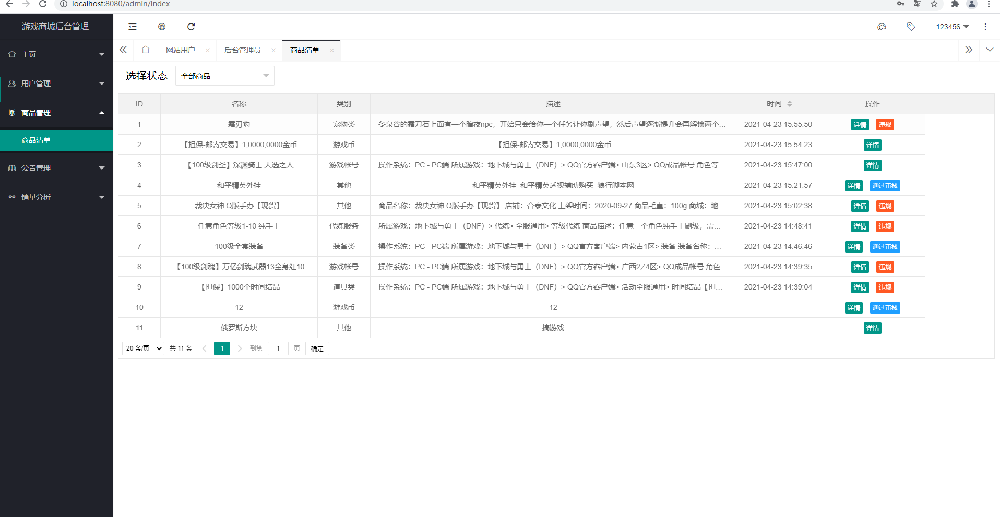
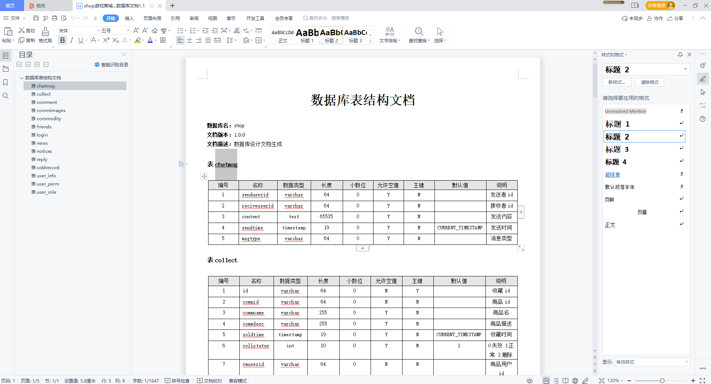
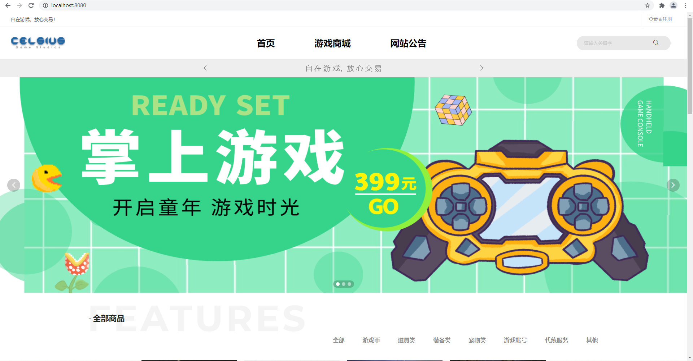
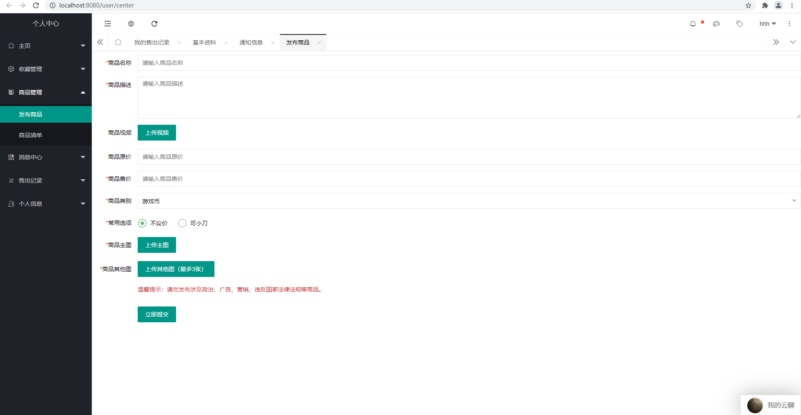

# 基于springboot在线游戏商城系统

#### 介绍
基于springboot在线游戏商城系统，前端采用layui+js，主要分两端Web端与管理后端，代码规范整洁，技术选型也非常经典，合适初学java编程者学习以及计算机专业学生。

#### 软件架构
前端：layui+js | jquery | bootstrap  
后端：spring | springmvc | mybatis  
环境：jdk1.8 | maven | mysql | tomcat      

#### 功能介绍

##### 【功能详述】 

- 游戏商城首页

    

- 商品清单

    

- 数据库文档

    

- 首页

    

- 发布商品

    

#### 使用说明
1. 创建数据库，执行数据库脚本  
2. 修改jdbc数据库连接参数  
3. 下载安装maven依赖jar  
4. 启动SpringBoot启动类  

#### 后端管理

请求地址： http://localhost:8080/

用户名：admin

密码：123456   